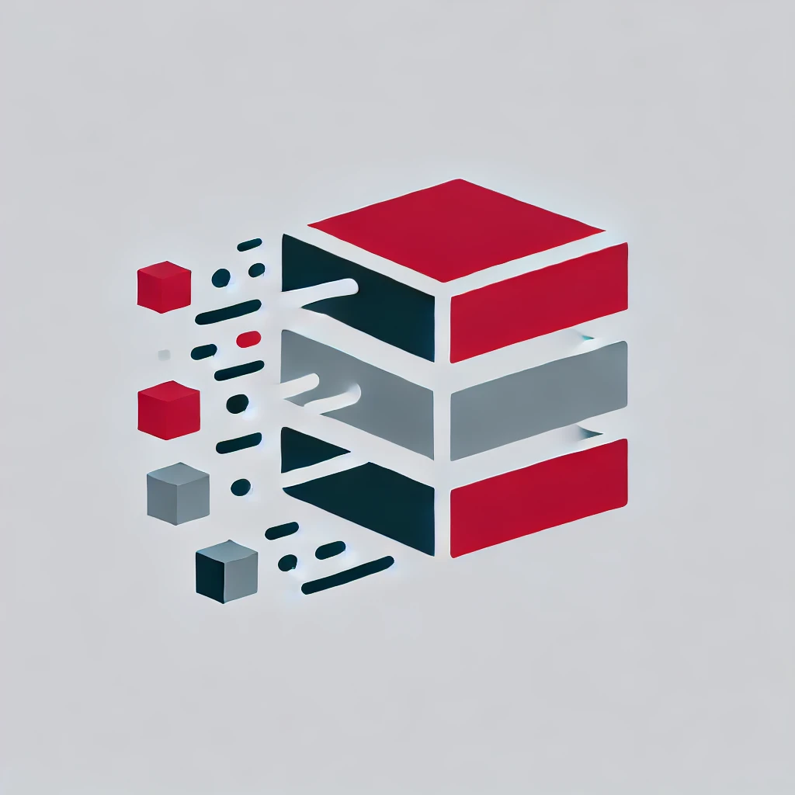

<div align="center">



# Cache-Cache

Own implementation of redis for learning purposes (I will try to work on this)

</div>

---

Cache-Cache is my own implementation of redis. With that I wanted to learn new things:

- My own hmap implementation
- Make some linked list to remind me academical exercices
- [AVL Tree](https://en.wikipedia.org/wiki/AVL_tree)
- Implementation of a Thread pool
- Intrusive data structure

---


### Intrusive data structure

An intrusive data structure is a type of data where the data elements themselves contains a pointer or a reference to other elements of the structure.
This allow redis to nore memory and cache efficient since they do not requires a separate wrapper or containers.
Therefore thre is less inderiction when accessing linked elements

For example it might look like that:

```c
struct Node {
    int data;
    Node* next;
};
```


Source:

<sup><sub>[Build your own redis](https://build-your-own.org/redis/#table-of-contents)</sub></sup>
